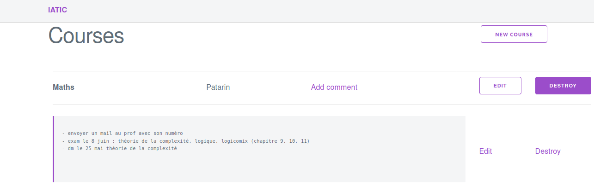
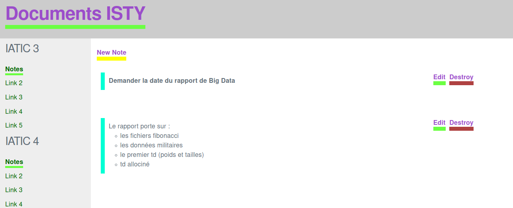

# IATIC

IATIC is a rails app to keep track of school assignements.

## V1



## V2



## Install

```
git clone git@github.com:Poulpy/IATIC.git

cd iatic

rake db:create && rake db:migrate

rails server
```


### Notes & troubleshooting

```bash
rails new iatic --database=postgresql --webpack

# install nodejs on Ubuntu focal
sudo snap install node --classic --channel=8/stable

# install webpacker
# rails webpacker:install

# Start server
rails s

# migrations
rails g scaffold course

rake db:migrate

rails generate migration RemoveAuthorFromCourses author:string

rake db:migrate

# for file management in database
rails active_storage:install && rails db:migrate RAILS_ENV=development 
rails actiontext:install 

# Install ImageMagick

```

### TODO

- Document uploader (has many documents)
- Refactor CSS everywhere
- Show attachments on edit page (course/comment)


